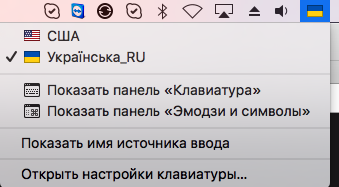

Cyrillic keyboard
=================

For particular reason I don't like to look at *that* flag anymore.
So I hacked my keyboard layout, changed it's name, flag and
added missing Ukrainian-Cyrillic letters to it.

UPD: Added a version of standard "Cyrillic phonetic" keybord layout with a better flag.

How to use
----------

1. Copy **'Cyrillic bilingual.bundle'** into **'/Library/Keyboard\\ Layouts'**
2. Go to Keyboard preferences
3. Click on '+' to add new input source and select 'Other' submenu
4. Find find and choose 'Українська_RU' language from list of input sources
5. Feel like a hero and enjoy typing

Ukrainian-cyrillic keys:
----------
- `alt-и` or `alt-і` for і
- `alt-й` or `alt-§` or `alt-ї` for ї
- `alt-э` є
- `alt-г` for ґ

Bonus keys:
----------
- alt-е
- alt-ц

**Glory to Ukraine! Слава Україні!**
